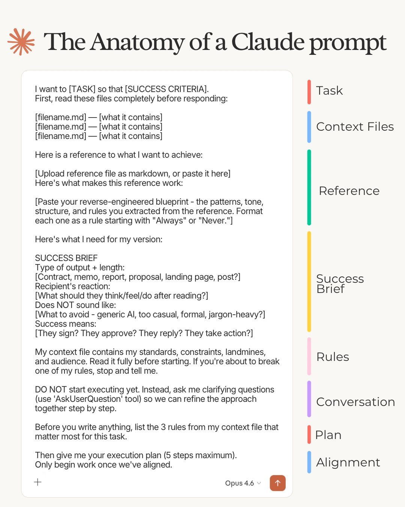

# The Anatomy of a Claude 4.6 Prompt

## Description

Visual anatomy of a Claude prompt, with eight color-coded sections: Task, Context Files, Reference, Success Brief, Rules, Conversation, Plan, Alignment.

## Image

## Usage

Attach `prompt.jpg` to a Claude session along with your task description,
or paste it inline if your client supports image uploads.
