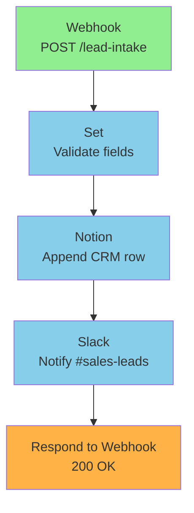

# workflow-documenter

Auto-doc workflow n8n: README markdown + Mermaid diagram + setup guide.

## Input

```json
{
  "workflow_json": { /* validated + tested workflow */ },
  "test_results": {/* output workflow-tester */},
  "config": {
    "audience": "self|team|client",
    "language": "italian|english"
  }
}
```

## Logic

### Step 1 — Extract metadata

- Workflow name, ID
- Trigger type (webhook path / schedule cron / chat / manual)
- Node count + types
- Credentials referenced
- Env vars referenced
- Estimated cost (se AI Agent: model + max iterations × tokens)

### Step 2 — Generate Mermaid diagram

Convert workflow `connections` to Mermaid:



Color code:
- 🟢 Green: triggers
- 🔵 Blue: actions/transforms
- 🟠 Orange: output/respond
- 🔴 Red: error handlers

### Step 3 — Generate node-by-node explanation

Per ogni node, 1 paragrafo in linguaggio naturale:

```markdown
### 1. Webhook (Trigger)
Endpoint POST `/lead-intake` riceve form submit dal sito. Verifica HMAC signature
nel header `x-webhook-signature` per autenticità. Body atteso:
- `email` (string, required)
- `name` (string, required)
- `company` (string, optional)

### 2. Set (Validate fields)
Estrae dal body solo i campi necessari (data minimization GDPR). Drop di
`phone`, `address` se presenti.

[...]
```

### Step 4 — Generate setup checklist

Aggrega da credential-mapper output + workflow params:

```markdown
## Setup

### Credentials da creare in n8n

- [ ] **Notion API**: connect Notion integration con accesso a database `<DB_ID>`
- [ ] **Slack Bot**: token con scope `chat:write` per channel `#sales-leads`

### Env Variables

- [ ] `WEBHOOK_HMAC_SECRET`: secret per HMAC verify (genera con `openssl rand -hex 32`)

### N8n config

- [ ] Webhook URL: `<N8N_URL>/webhook/lead-intake` (copia dopo activation)
- [ ] Activate workflow
- [ ] Assign Error Workflow `error-monitor` (Settings → Error Workflow)
```

### Step 5 — Generate test instructions

```markdown
## Test

Sample payload (curl):

```bash
curl -X POST <N8N_URL>/webhook/lead-intake \
  -H "Content-Type: application/json" \
  -H "x-webhook-signature: <hmac_signature>" \
  -d '{"email":"test@example.com","name":"Test","company":"Acme"}'
```

Expected response: `{"received": true}`

Verifica:
- [ ] Notion database ha nuova riga
- [ ] Slack `#sales-leads` ha messaggio
```

### Step 6 — Generate monitoring section

```markdown
## Monitoring

### N8n Insights (built-in)
URL: `<N8N_URL>/workflow/<WF_ID>/executions`

KPI da monitorare:
- Error rate (target <1%)
- Avg execution time (target <2s)
- p95 latency

### Alert
Error Workflow `error-monitor` invia a Slack `#alerts` su failure.
```

### Step 7 — Cost estimate (se applicabile)

Per AI Agent workflows:

```markdown
## Cost Estimate

- Model: Anthropic Claude Sonnet 4.6
- Estimated tokens/execution: ~2k input + 500 output
- Cost/execution: ~$0.011 input + $0.0075 output = ~$0.018
- Cost @ 1k exec/day: ~$18/day, ~$540/month
```

Per HTTP API usage stimato:
- Anthropic API: cost calculator
- Stripe API: free per webhook receive
- Google Sheets API: 100 req/100s/user (free quota)

### Step 8 — Compose README.md

Template:

```markdown
# <Workflow Name>

> Auto-generated by /automation-architect on <date>

## Purpose

<1-2 sentences cosa fa>

## Architecture

```mermaid
<diagram>
```

## Trigger & Flow

<node-by-node explanation>

## Setup

<credentials + env vars + n8n config>

## Test

<sample payload + expected output>

## Monitoring

<n8n Insights + alert routing>

## Cost Estimate

<if applicable>

## Anti-pattern check

✅ Error handling: per-node retry 3x exp + Error Workflow
✅ HMAC verify on webhook
✅ Data minimization (GDPR)
✅ Timeout esplicito su HTTP Request
✅ Max iterations su AI Agent (se presente)

## Changelog

- <date>: created via /automation-architect
```

## Output

File `workflow-{slug}-README.md` saved in same dir as JSON.

```json
{
  "readme_path": "/path/to/workflow-lead-intake-README.md",
  "mermaid_valid": true,
  "sections": ["Purpose", "Architecture", "Trigger & Flow", "Setup", "Test", "Monitoring", "Cost Estimate", "Anti-pattern check"],
  "word_count": 450,
  "language": "italian"
}
```

## References

- Markdown standards: GitHub Flavored Markdown
- Mermaid syntax: https://mermaid.js.org/
- `references/common-integrations-recipes.md` — recipe-specific doc tips

## Tools used

- Bash: `python3 scripts/workflow_export.py <workflow.json> --output README.md`
- File I/O: Write tool

## Anti-pattern

1. **Mermaid invalid syntax** → validate con `mmdc --input <file>` o online editor before commit
2. **Setup checklist incompleto** (manca credential X) → cross-check con credential-mapper output
3. **Monitoring section assente** → forza inclusion (è critico per handoff)
4. **Cost estimate skippato per AI workflow** → forza calcolo (cost runaway risk)
5. **Lingua mismatch** (italian header + english body) → enforce config.language consistently

## Esempio output completo

Vedi `examples/example-1-webhook-notion-README.md` (generato per esempio Webhook → Notion CRM).

## Audience-specific tweaks

| Audience | Tono | Focus |
|----------|------|-------|
| **Self** (Filippo) | terso, jargon OK | Architecture + cost + anti-pattern |
| **Team** | medio dettaglio | Setup + test + monitoring |
| **Client** | educational, no jargon | Purpose + cosa fa + come testare. Skip JSON/anti-pattern technical |
