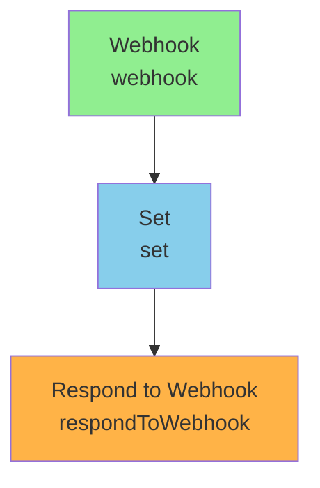

# test-lead-intake

> Auto-generated by /automation-architect on 2026-05-01

## Purpose

<!-- TODO: 1-2 sentences cosa fa il workflow -->

## Architecture



## Trigger & Flow

### 1. Webhook

- **Type**: `n8n-nodes-base.webhook`
- **Purpose**: <!-- TODO: brief explanation -->

### 2. Set

- **Type**: `n8n-nodes-base.set`
- **Purpose**: <!-- TODO: brief explanation -->

### 3. Respond to Webhook

- **Type**: `n8n-nodes-base.respondToWebhook`
- **Purpose**: <!-- TODO: brief explanation -->

## Setup

### N8n config

- [ ] Activate workflow
- [ ] Assign Error Workflow (Settings → Error Workflow)

## Test

Sample payload:

```bash
# TODO: insert curl example
```

## Monitoring

- N8n Insights: `<N8N_URL>/workflow/<WF_ID>/executions`
- Error Workflow alerts to: <!-- Slack channel / email -->

## Anti-pattern check

- [ ] Error handling: per-node retry + Error Workflow assigned
- [ ] No hardcoded secrets (use n8n credentials or env vars)
- [ ] Webhook HMAC verify (if applicable)
- [ ] Data minimization (GDPR mode)
- [ ] HTTP Request timeout esplicito (5000ms)
- [ ] Max iterations su AI Agent (10 default)

## Changelog

- 2026-05-01: created via /automation-architect
